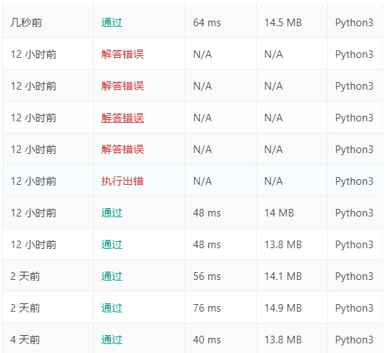
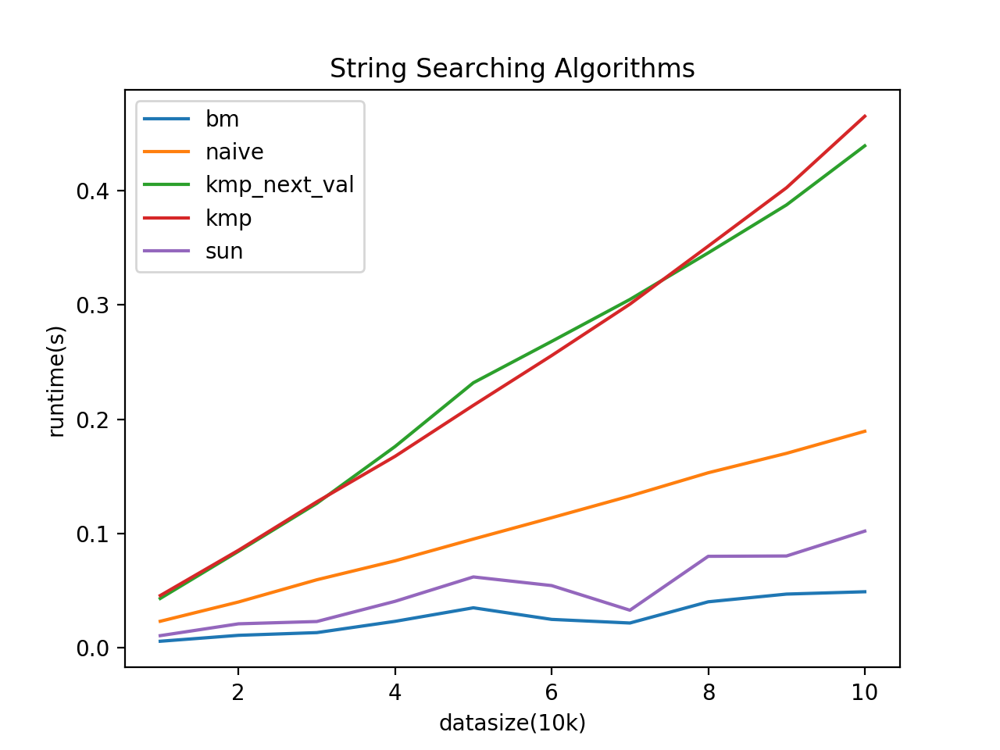
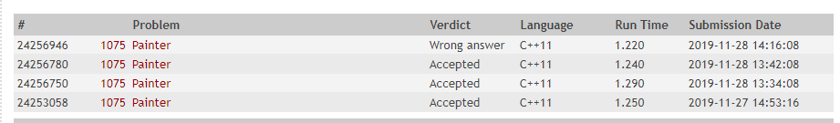

## This repository is used to record algorithm assignments.
### Assigment 1: String Searching Algorithms
Please make sure you have installed python3.x in your computer.  
Have no idea with installation? [Please Click here.](https://www.python.org/downloads/) 

How to run this project?  
  1. `pip install matplotlib`
  2. `cd assignment1/ && python main.py`  

Online judge:  

Running results:  

### Assignment 2: Painter
Running result on OJ:

